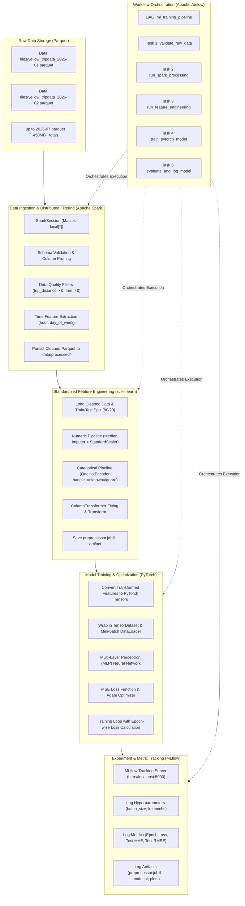
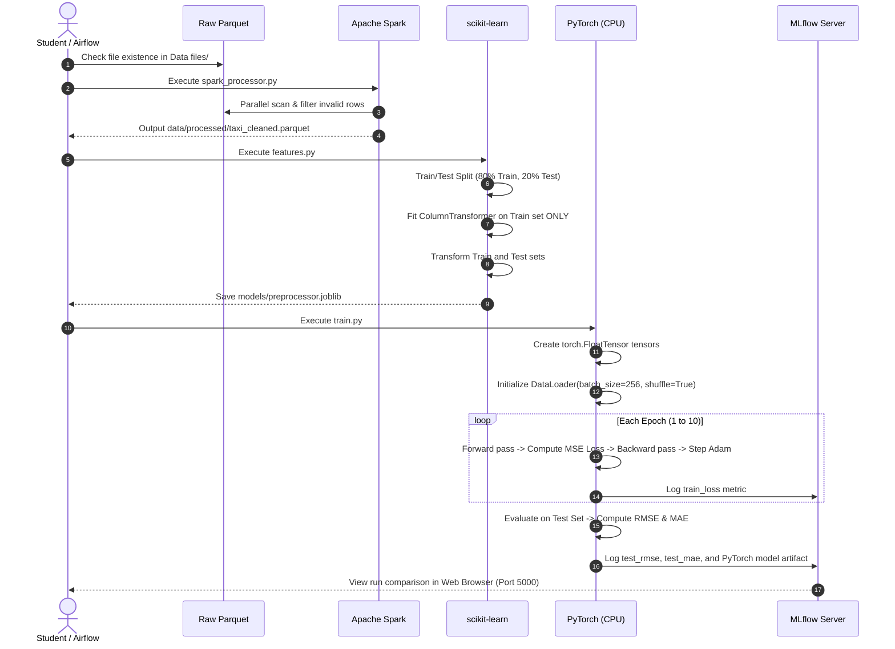
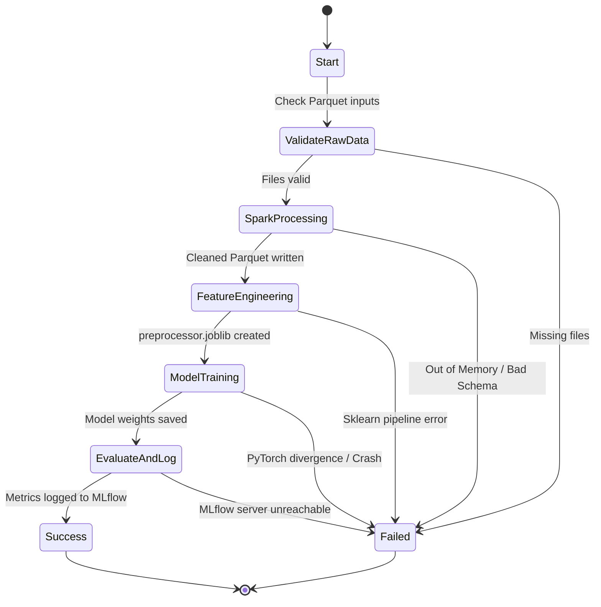
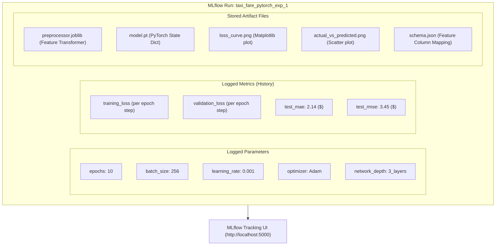

# Enterprise ML Pipeline POC: Spark + Airflow + scikit-learn + PyTorch + MLflow
## Comprehensive Hands-On Guide & Implementation Blueprint (Student Edition)


> **Topic:** Building a Production-Grade, End-to-End Machine Learning Platform  
> **Primary Dataset:** NYC Yellow Taxi Trip Records (Parquet, 2026 data pre-loaded in workspace)  
> **Author & Mentor:** NashTech AI & Data Engineering Competency  

---

## Table of Contents

1. [Welcome & Conceptual Overview (The "Why" Before the "How")](#1-welcome--conceptual-overview-the-why-before-the-how)
2. [Visual Architecture Blueprints & Interactive Flowcharts](#2-visual-architecture-blueprints--interactive-flowcharts)
   - [2.1 End-to-End System Architecture](#21-end-to-end-system-architecture)
   - [2.2 Detailed Data Lifecycle & Transformation Pipeline](#22-detailed-data-lifecycle--transformation-pipeline)
   - [2.3 Machine Learning Feature Pipeline & Tensor Flow](#23-machine-learning-feature-pipeline--tensor-flow)
   - [2.4 Airflow DAG Execution Flow](#24-airflow-dag-execution-flow)
   - [2.5 MLflow Tracking & Artifact Storage Blueprint](#25-mlflow-tracking--artifact-storage-blueprint)

3. [Prerequisites & System Requirements](#3-prerequisites--system-requirements)
4. [Step-by-Step Environment Setup Guide (Foolproof)](#4-step-by-step-environment-setup-guide-foolproof)
   - [Step 4.1: Windows Pre-flight & WSL2 Ubuntu Installation](#step-41-windows-pre-flight--wsl2-ubuntu-installation)
   - [Step 4.2: Linux Shell Basics & System Package Updates](#step-42-linux-shell-basics--system-package-updates)
   - [Step 4.3: Java 17 (OpenJDK) Installation & Path Configuration](#step-43-java-17-openjdk-installation--path-configuration)
   - [Step 4.4: Dual Virtual Environment Strategy (Why & How)](#step-44-dual-virtual-environment-strategy-why--how)
   - [Step 4.5: PySpark Installation & Verification](#step-45-pyspark-installation--verification)
   - [Step 4.6: Data Science & PyTorch Setup](#step-46-data-science--pytorch-setup)
   - [Step 4.7: MLflow Tracking Server Setup](#step-47-mlflow-tracking-server-setup)
   - [Step 4.8: Apache Airflow Setup (Isolated Environment)](#step-48-apache-airflow-setup-isolated-environment)
5. [Project Directory Layout & Workspace Navigation](#5-project-directory-layout--workspace-navigation)
6. [The Dataset & The Machine Learning Problem](#6-the-dataset--the-machine-learning-problem)
   - [6.1 Understanding NYC Taxi Parquet Files](#61-understanding-nyc-taxi-parquet-files)
   - [6.2 The Prediction Objective & Feature Rationale](#62-the-prediction-objective--feature-rationale)
   - [6.3 The Golden Rule of Big Data ML: Never `df.toPandas()` blindly!](#63-the-golden-rule-of-big-data-ml-never-dftopandas-blindly)

7. [From POC to Enterprise Production (The Senior Engineer Mindset)](#7-from-poc-to-enterprise-production-the-senior-engineer-mindset)

---

## 1. Welcome & Conceptual Overview (The "Why" Before the "How")

### 1.1 Welcome to the Real World of Machine Learning Engineering!
In university courses, machine learning is almost always taught using small CSV files loaded into a single Jupyter Notebook:
```python
import pandas as pd
df = pd.read_csv("data.csv")  # Works fine for 10,000 rows!
# ... train model ...
```

However, in the real enterprise world (banking, logistics, e-commerce, telecommunications), datasets do not fit in RAM. They consist of **billions of rows**, hundreds of gigabytes, arriving daily in compressed columnar formats like **Parquet**. 

Furthermore, real-world systems cannot rely on a human manually clicking "Run All" in a notebook. Pipelines must run automatically at 2:00 AM, log every hyperparameter, track model versions, restart gracefully if a step fails, and notify engineers if data drifts.

This Proof-of-Concept (POC) brings together the **five industry-standard technologies** that solve this challenge:

```text
┌────────────────────────────────────────────────────────────────────────┐
│                        THE BIG FIVE TECH STACK                         │
├─────────────────┬──────────────────────────────────────────────────────┤
│ 1. Apache Spark │ Distributed compute for gigabyte/terabyte-scale data │
│ 2. scikit-learn │ Standardized, reproducible feature engineering       │
│ 3. PyTorch      │ Modern deep learning framework for flexible modeling │
│ 4. MLflow       │ Experiment tracking, parameter logging, model registry│
│ 5. Apache Airflow│ Production workflow scheduler and DAG orchestrator   │
└─────────────────┴──────────────────────────────────────────────────────┘
```

---

### 1.2 The Factory Assembly Line Analogy
To understand how these five technologies collaborate, imagine a high-tech automobile factory:

```text
  [ Raw Metal & Steel ]      ───> 1. SPARK: The Heavy Smelting Plant
                                   Cuts, washes, filters tons of ore down to refined parts.
                                              │
                                              ▼
  [ Refined Components ]    ───> 2. SCIKIT-LEARN: The Precision Milling Station
                                   Scales, normalizes, and encodes parts into standard fittings.
                                              │
                                              ▼
  [ Standardized Inputs ]   ───> 3. PYTORCH: The High-Performance Engine Builder
                                   Assembles neural connections and optimizes horsepower.
                                              │
                                              ▼
  [ Completed Engine ]      ───> 4. MLFLOW: The Quality Inspection & Log Book
                                   Tags serial numbers, records dyno metrics, archives models.
                                              │
                                              ▲
  [ The Plant Supervisor ]  ───> 5. AIRFLOW: The Factory Automation Controller
                                   Triggers shifts, monitors line health, triggers emergency stops.
```

---

## 2. Visual Architecture Blueprints & Interactive Flowcharts

### 2.1 End-to-End System Architecture



---

### 2.2 Detailed Data Lifecycle & Transformation Pipeline

```mermaid
flowchart LR
    A["Raw Parquet Files\n(~20 Million Rows total)"] --> B["Apache Spark Engine\nDistributed Local Cluster"]
    B --> C["Filter Outliers:\n- fare_amount > 0 and < 500\n- trip_distance > 0 and < 100\n- drop NULL locations"]
    C --> D["Feature Derivation:\n- pickup_hour (0-23)\n- pickup_day_of_week (1-7)"]
    D --> E["Controlled Sample Dataset\nSaved as data/processed/taxi_cleaned.parquet"]
    E --> F["scikit-learn ColumnTransformer\nNumeric: StandardScaler\nCategorical: OneHotEncoder"]
    F --> G["Feature Matrix (X)\nNormalized Floats [N x D]"]
    G --> H["PyTorch TensorDataset\nDataLoader (Batch Size: 256)"]
    H --> I["PyTorch MLP Regressor\nLinear(D->128)->ReLU->Linear(64)->Linear(1)"]
```



---

### 2.3 Machine Learning Feature Pipeline & Tensor Flow



---

### 2.4 Airflow DAG Execution Flow



---

### 2.5 MLflow Tracking & Artifact Storage Blueprint



---

---

## 3. Prerequisites & System Requirements

Before you type a single line of code, verify your machine capabilities.

### 3.1 Hardware Checklist
| Resource | Minimum Spec | Recommended Spec | Why is it needed? |
|---|---|---|---|
| **RAM** | 8 GB | 16 GB – 32 GB | Spark and PyTorch run locally in RAM. |
| **CPU** | 4 Cores (x86_64) | 8 Cores (Intel i7/i9 or AMD Ryzen 7) | Spark distributes processing across cores (`local[*]`). |
| **Free Disk** | 25 GB free | 50 GB+ SSD | Parquet files, virtual environments, Java runtime, and logs. |
| **GPU** | None (CPU only) | NVIDIA CUDA GPU (Optional) | For this POC, CPU is 100% fine and simpler to configure. |
| **Operating System** | Windows 10/11 | Windows 11 with WSL2 | Airflow runs natively on Linux, not Windows directly. |

> [!IMPORTANT]
> **Windows Hardware Virtualization Check:**  
> Press `Ctrl + Shift + Esc` to open **Task Manager** -> Click the **Performance** tab -> Click **CPU**.  
> Look at the bottom-right corner: **Virtualization: Enabled** must be shown. If it says *Disabled*, you must restart your computer, press `F2` or `Del` to enter BIOS, and enable Intel VT-x or AMD SVM.

---

## 4. Step-by-Step Environment Setup Guide (Foolproof)

This section is written with extreme precision so that no student encounters unexpected command errors.

### Step 4.1: Windows Pre-flight & WSL2 Ubuntu Installation

**What is WSL2?**  
Windows Subsystem for Linux 2 (WSL2) runs a genuine Linux kernel directly inside Windows. Tools like Apache Airflow and PySpark operate far more reliably in Linux than on native Windows.

#### Execution Steps:
1. Open **Windows PowerShell** as **Administrator** (Right-click Start button -> "Terminal (Admin)" or "Windows PowerShell (Admin)").
2. Run the install command:
   ```powershell
   wsl --install
   ```
3. If WSL was already installed, update it:
   ```powershell
   wsl --update
   ```
4. **Restart your Windows PC** if prompted.
5. After reboot, Ubuntu will open a black terminal window and ask:
   ```text
   Enter new UNIX username: student
   New password: <type your password - NOTE: letters will not show on screen for security>
   Retype new password: <retype password>
   ```
6. Check your WSL status from PowerShell:
   ```powershell
   wsl --list --verbose
   ```
   *Expected Output:*
   ```text
     NAME      STATE           VERSION
   * Ubuntu    Running         2
   ```
   *(Ensure VERSION is 2. If it is 1, run `wsl --set-version Ubuntu 2`)*

---

### Step 4.2: Linux Shell Basics & System Package Updates

Open your Ubuntu terminal by running `wsl` in Windows PowerShell or clicking **Ubuntu** in the Start Menu.

> [!NOTE]
> **Understanding File Paths Between Windows and Linux:**  
> Your Windows `C:\` drive is automatically mounted inside Ubuntu at `/mnt/c/`.  
> Your current Git repository is located at:  
> `/mnt/c/Users/<YourUsername>/OneDrive - NASHTECH/Documents/AllGithubRepos/Personal Repo/Nashtech POC/POC-for-Spark-Airflow-Scikit-learn-PyTorch-/`

Let's update Ubuntu system packages:
```bash
# Refresh package index
sudo apt update

# Upgrade existing packages to latest security releases
sudo apt upgrade -y

# Install essential development utilities
sudo apt install -y \
    git \
    curl \
    wget \
    unzip \
    build-essential \
    python3 \
    python3-pip \
    python3-venv \
    htop \
    tree
```

Verify Python:
```bash
python3 --version
# Expected: Python 3.10.x, 3.11.x, or 3.12.x
```

---

### Step 4.3: Java 17 (OpenJDK) Installation & Path Configuration

**Why does PySpark need Java?**  
Even though we write Python code (`pyspark`), Spark's core distributed computational engine is written in **Scala and Java**. Spark runs inside the Java Virtual Machine (JVM).

1. Install OpenJDK 17:
   ```bash
   sudo apt install -y openjdk-17-jdk
   ```

2. Verify Java installation:
   ```bash
   java -version
   ```
   *Expected Output:*
   ```text
   openjdk version "17.0.x" 202x-xx-xx
   OpenJDK Runtime Environment (build 17.0.x+...)
   OpenJDK 64-Bit Server VM (build 17.0.x+...)
   ```

3. Find the exact Java path:
   ```bash
   readlink -f $(which java)
   # Typically prints: /usr/lib/jvm/java-17-openjdk-amd64/bin/java
   ```

4. Configure `JAVA_HOME` permanently in your shell:
   ```bash
   echo 'export JAVA_HOME=/usr/lib/jvm/java-17-openjdk-amd64' >> ~/.bashrc
   echo 'export PATH=$JAVA_HOME/bin:$PATH' >> ~/.bashrc
   source ~/.bashrc
   ```

5. Confirm `JAVA_HOME` is set:
   ```bash
   echo $JAVA_HOME
   # Must output: /usr/lib/jvm/java-17-openjdk-amd64
   ```

---

### Step 4.4: Dual Virtual Environment Strategy (Why & How)

> [!CRITICAL]
> **The #1 Error College Students Make:** Trying to install Spark, PyTorch, and Apache Airflow into the exact same Python environment!  
> **Why is this bad?** Apache Airflow depends on hundreds of specific library versions (Flask, Jinja2, Werkzeug, SQLAlchemy). PyTorch and Spark also have strict dependencies. When installed together, pip dependency resolution fails with hundreds of conflicts.

**The Professional Solution:** Create **two separate virtual environments**:
1. `ml-env`: Houses PySpark, scikit-learn, PyTorch, MLflow, and pandas.
2. `airflow-env`: Houses Apache Airflow and its web server. Airflow triggers the ML scripts using bash commands pointing to `ml-env`.

```text
┌──────────────────────────────────────┐     ┌──────────────────────────────────────┐
│        ml-env (Python 3.11)          │     │      airflow-env (Python 3.11)       │
├──────────────────────────────────────┤     ├──────────────────────────────────────┤
│ • pyspark 3.5.x                      │     │ • apache-airflow 2.8.x / 2.10.x      │
│ • torch 2.x (CPU)                    │     │ • airflow webserver                  │
│ • scikit-learn                       │     │ • airflow scheduler                  │
│ • mlflow                             │     │ • SQLite metadata database           │
│ • pandas, numpy, pyarrow             │     │                                      │
└──────────────────┬───────────────────┘     └──────────────────┬───────────────────┘
                   ▲                                            │
                   └─────── Triggers ML tasks via Bash ─────────┘
```

Let's create the directories and the first environment:
```bash
# Navigate to your user home directory in Linux
cd ~
mkdir -p ml-platform-poc
cd ml-platform-poc

# Create the ML environment
python3 -m venv ml-env

# Activate the ML environment
source ml-env/bin/activate

# Upgrade pip
python -m pip install --upgrade pip setuptools wheel
```

*(Notice your prompt now begins with `(ml-env)`)*

---

### Step 4.5: PySpark Installation & Verification

With `(ml-env)` active:
```bash
pip install pyspark==3.5.1
```

Let's run a verification test to prove PySpark and Java communicate smoothly:
Create a quick script `test_pyspark.py`:
```bash
python -c '
from pyspark.sql import SparkSession
spark = SparkSession.builder.appName("TestCheck").master("local[*]").getOrCreate()
print("\n>>> SUCCESS: PySpark session created! Version:", spark.version)
spark.stop()
'
```

*Expected Terminal Output:*
```text
>>> SUCCESS: PySpark session created! Version: 3.5.1
```

---

### Step 4.6: Data Science & PyTorch Setup

With `(ml-env)` still active:
```bash
# Install core data science and evaluation libraries
pip install \
    pandas==2.2.2 \
    numpy==1.26.4 \
    pyarrow==16.1.0 \
    scikit-learn==1.5.0 \
    joblib==1.4.2 \
    matplotlib==3.9.0 \
    pyyaml==6.0.1 \
    pytest==8.2.2

# Install CPU version of PyTorch
pip install torch --index-url https://download.pytorch.org/whl/cpu
```

Verify PyTorch:
```bash
python -c '
import torch
print(">>> PyTorch Version:", torch.__version__)
print(">>> CUDA Available (Expected False for CPU):", torch.cuda.is_available())
x = torch.rand(5, 3)
print(">>> Sample Random Tensor:\n", x)
'
```

---

### Step 4.7: MLflow Tracking Server Setup

With `(ml-env)` active:
```bash
pip install mlflow==2.14.1
```

Verify MLflow:
```bash
mlflow --version
# Expected: mlflow, version 2.14.1
```

**How to run MLflow Server:**
```bash
mlflow server \
    --backend-store-uri sqlite:///mlflow.db \
    --default-artifact-root ./mlruns \
    --host 0.0.0.0 \
    --port 5000
```
Open your Windows web browser and visit: `http://localhost:5000`. You will see the beautiful MLflow Tracking Dashboard!  
*(To stop the server for now, press `Ctrl + C`)*.

---

### Step 4.8: Apache Airflow Setup (Isolated Environment)

Now let's set up the second virtual environment for Airflow:
```bash
# Deactivate ml-env
deactivate

# Create airflow-env
python3 -m venv ~/airflow-env

# Activate airflow-env
source ~/airflow-env/bin/activate
pip install --upgrade pip

# Define Airflow Home directory
export AIRFLOW_HOME=~/airflow

# Install Apache Airflow using official constraint file matching your Python version
AIRFLOW_VERSION=2.9.2
PYTHON_VERSION="$(python --version | cut -d " " -f 2 | cut -d "." -f 1-2)"
CONSTRAINT_URL="https://raw.githubusercontent.com/apache/airflow/constraints-${AIRFLOW_VERSION}/constraints-${PYTHON_VERSION}.txt"
pip install "apache-airflow==${AIRFLOW_VERSION}" --constraint "${CONSTRAINT_URL}"
```

Verify Airflow:
```bash
airflow version
# Expected: 2.9.2
```

Initialize Airflow in standalone mode (for local development testing):
```bash
# Start standalone Airflow (automatically initializes DB and user)
airflow standalone
```

> [!NOTE]
> When `airflow standalone` starts for the first time, look at the terminal output carefully!  
> It will output:
> ```text
> Login with username: admin  password: <RANDOM_GENERATED_PASSWORD>
> Airflow is ready: http://localhost:8080
> ```
> Save this password in a text file! You will log into `http://localhost:8080` using `admin` and that password.  
> *(Press `Ctrl + C` to stop it for now)*.

---

## 5. Project Directory Layout & Workspace Navigation

Here is the exact production-ready directory structure you must maintain:

```text
POC-for-Spark-Airflow-Scikit-learn-PyTorch-/
│
├── .gitignore                    # Prevents checking in virtualenvs, caches, big data
├── README.md                     # High-level repo summary
├── plan.md                       # Original high-level plan
├── NewPlan.md                    # THIS detailed master implementation guide
│
├── Data files/                   # PRE-EXISTING RAW DATA (Already downloaded!)
│   ├── yellow_tripdata_2026-01.parquet (~64 MB)
│   ├── yellow_tripdata_2026-02.parquet (~58 MB)
│   ├── yellow_tripdata_2026-03.parquet (~67 MB)
│   ├── yellow_tripdata_2026-04.parquet (~64 MB)
│   ├── yellow_tripdata_2026-05.parquet (~69 MB)
│   ├── yellow_tripdata_2026-06.parquet (~65 MB)
│   └── yellow_tripdata_2026-07.parquet (~61 MB)
│
├── data/                         # PIPELINE RUNTIME DATA
│   ├── raw/                      # Symlink or copy of raw parquet files
│   ├── processed/                # Spark-cleaned Parquet datasets
│   └── training/                 # Train/test numpy splits or staging files
│
├── config/                       # CENTRAL CONFIGURATIONS (YAML)
│   ├── development.yaml          # Local test settings (smaller sample, fewer epochs)
│   └── production.yaml           # Scaling settings (full data, distributed tuning)
│
├── src/                          # MODULAR PYTHON SOURCE CODE
│   ├── __init__.py
│   ├── utils.py                  # Logger and config loader helpers
│   ├── ingestion/
│   │   ├── __init__.py
│   │   └── spark_processor.py    # Spark cleaning and feature derivation
│   ├── preprocessing/
│   │   ├── __init__.py
│   │   └── features.py           # scikit-learn ColumnTransformer & scaling
│   ├── training/
│   │   ├── __init__.py
│   │   ├── model.py              # PyTorch FareModel (nn.Module)
│   │   └── train.py              # PyTorch training loop & checkpointing
│   ├── evaluation/
│   │   ├── __init__.py
│   │   └── evaluate.py           # Metrics calculation (RMSE, MAE, R2) & plots
│   └── tracking/
│       ├── __init__.py
│       └── mlflow_utils.py       # MLflow logging wrappers
│
├── dags/                         # AIRFLOW DAG DEFINITIONS
│   └── ml_training_pipeline.py   # Airflow DAG orchestrating all src/ steps
│
├── models/                       # SERIALIZED MODEL ARTIFACTS
│   ├── preprocessor.joblib       # Saved scikit-learn transformer
│   └── fare_model.pt             # Saved PyTorch model weights
│
├── notebooks/                    # JUPYTER EXPLORATION NOTEBOOKS
│   └── 01_data_exploration.ipynb # Initial EDA on NYC Taxi data
│
├── tests/                        # AUTOMATED UNIT TESTS (pytest)
│   ├── test_spark_processor.py   # Tests Spark transformations
│   ├── test_features.py          # Tests sklearn transformer shapes
│   └── test_model.py             # Tests PyTorch forward pass & loss
│
├── scripts/                      # UTILITY BASH SCRIPTS
│   ├── run_pipeline_local.sh     # Manual end-to-end test script
│   └── start_services.sh         # Starts MLflow and Airflow concurrently
│
├── requirements.txt              # ML Environment dependencies
└── requirements-airflow.txt      # Airflow dependencies
```

Create this directory structure right now with one command:
```bash
mkdir -p data/raw data/processed data/training \
         config src/ingestion src/preprocessing src/training src/evaluation src/tracking \
         dags models notebooks tests scripts logs
```

---

## 6. The Dataset & The Machine Learning Problem

### 6.1 Understanding NYC Taxi Parquet Files
Look inside your repository's `Data files/` directory. You will see 7 monthly Parquet files for 2026:
- `yellow_tripdata_2026-01.parquet`
- `yellow_tripdata_2026-02.parquet`
- ... up to `yellow_tripdata_2026-07.parquet`

**What is Parquet?**  
Unlike CSV (which is row-based plain text), **Apache Parquet** is a binary, column-oriented storage format with built-in compression (Snappy) and column statistics (min/max/nulls). Parquet allows Spark to read only the specific columns needed for training, skipping unnecessary data and boosting speed by 10x to 50x!

Key Columns in the NYC Yellow Taxi Dataset:
```text
┌───────────────────────┬──────────────┬────────────────────────────────────────────┐
│ Column Name           │ Data Type    │ Description                                │
├───────────────────────┼──────────────┼────────────────────────────────────────────┤
│ tpep_pickup_datetime  │ Timestamp    │ Exact date & time passenger was picked up  │
│ tpep_dropoff_datetime │ Timestamp    │ Exact date & time passenger was dropped off│
│ passenger_count       │ Double/Long  │ Number of passengers in vehicle            │
│ trip_distance         │ Double       │ Distance traveled in miles                 │
│ RatecodeID            │ Double/Long  │ Rate code (1=Standard, 2=JFK, 3=Newark...) │
│ PULocationID          │ Long         │ TLC Taxi Zone ID for pickup location       │
│ DOLocationID          │ Long         │ TLC Taxi Zone ID for dropoff location      │
│ payment_type          │ Long         │ Payment method (1=Credit card, 2=Cash)    │
│ fare_amount           │ Double       │ The base metered fare in USD (OUR TARGET!) │
│ total_amount          │ Double       │ Total charged (fare + tip + tolls + tax)   │
└───────────────────────┴──────────────┴────────────────────────────────────────────┘
```

---

### 6.2 The Prediction Objective & Feature Rationale

**Machine Learning Task:** **Regression**  
**Target Variable ($y$):** `fare_amount` (Float, representing dollars, e.g., $15.50)

**Input Features ($X$):**
1. `trip_distance` (Numeric, continuous): The single strongest predictor of taxi fare.
2. `passenger_count` (Numeric, discrete): Vehicle occupancy.
3. `pickup_hour` (Numeric, 0 to 23): Extracted from timestamp; captures rush hour vs late night pricing.
4. `pickup_day_of_week` (Numeric, 1 to 7): Extracted from timestamp; captures weekday commute vs weekend traffic.
5. `PULocationID` (Categorical): Pickup neighborhood zone (e.g., Zone 132 = JFK Airport).
6. `DOLocationID` (Categorical): Dropoff neighborhood zone.
7. `RatecodeID` (Categorical): Special rate classifications.

---

### 6.3 The Golden Rule of Big Data ML: Never `df.toPandas()` blindly!

```text
❌ WRONG (Crashes your computer):
   Raw Data (50 Million Rows) ──> Spark ──> df.toPandas() ──> [ OUT OF MEMORY CRASH! ]
   (Because 50M rows in Pandas expands to 16 GB+ of uncompressed RAM!)

✔️ CORRECT (Enterprise Standard):
   Raw Data (50 Million Rows) 
             │
             ▼
   [ Apache Spark Engine ]
   • Removes corrupt rows, negative fares, outliers
   • Performs column pruning
   • Extracts hour & day of week
   • Samples or aggregates down to a controlled training volume (e.g. 500,000 rows)
             │
             ▼
   Cleaned Staging Parquet (`data/processed/taxi_cleaned.parquet`)
             │
             ▼
   [ scikit-learn & PyTorch ]
   • Consumes the clean, controlled dataset safely in memory without memory spikes!
```

---

---

## 7. From POC to Enterprise Production (The Senior Engineer Mindset)

In your presentation, explain that while this POC runs locally on a single machine, its design mirrors enterprise architecture. Here is how every piece evolves in production:

| POC Component | Production Cloud Architecture | How it scales |
|---|---|---|
| **Local Spark (`local[*]`)** | **Databricks / AWS EMR / GCP Dataproc** | Distributed cluster of 50+ worker nodes handling 100 TBs. |
| **Local Parquet Files** | **Cloud Data Lake (AWS S3 / Azure ADLS / Google Cloud Storage)** | Highly durable, serverless object storage partitioned by year/month. |
| **scikit-learn Preprocessor** | **Feast Feature Store / Spark ML Pipeline** | Centralized feature computation for both batch training & real-time inference. |
| **PyTorch (Single CPU)** | **Distributed PyTorch (DDP / Horovod) on GPU Nodes** | Multi-GPU clusters (A100/H100) using mixed-precision (FP16) training. |
| **Local MLflow Server** | **Managed MLflow on AWS / Azure Databricks** | Backed by PostgreSQL DB and S3/GCS bucket for global team artifact sharing. |
| **Airflow Standalone** | **Managed Cloud Airflow (AWS MWAA / GCP Cloud Composer)** | CeleryExecutor / KubernetesExecutor auto-scaling worker pods in K8s. |
| **Saved `.pt` model file** | **Triton Inference Server / TorchServe / FastAPI** | Low-latency containerized microservice behind an API Gateway. |

---

---
*Created for NashTech AI Competency Proof-of-Concept. Designed for Excellence.*
